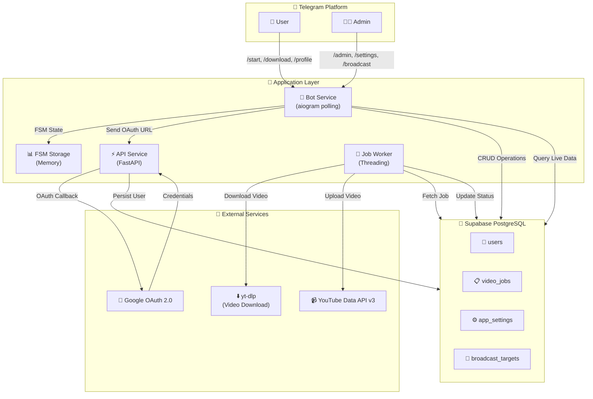

# 🎬 YouTube Auto Bot

> **Automate YouTube video uploads with Telegram** — A full-stack bot for downloading YouTube videos and uploading them to your YouTube channel with customizable metadata.


---

## 📋 Table of Contents

- [Overview](#-overview)
- [Architecture](#-architecture)
- [Features](#-features)
- [Tech Stack](#-tech-stack)
- [Quick Start](#-quick-start)
- [Installation](#-installation)
- [Configuration](#-configuration)
- [Running Locally](#-running-locally)
- [Deployment on Railway](#-deployment-on-railway)
- [Project Structure](#-project-structure)
- [Command Reference](#-command-reference)
- [Database Schema](#-database-schema)
- [Contributing](#-contributing)
- [License](#-license)

---

## 🎯 Overview

**YouTube Auto Bot** is a production-ready Telegram bot that enables users to:

✅ **Download YouTube videos** from any public URL  
✅ **Edit metadata** (title, description, visibility)  
✅ **Auto-upload to YouTube** using OAuth 2.0 authentication  
✅ **Track upload status** with real-time job management  
✅ **Admin dashboard** for system monitoring and global settings  
✅ **Persistent storage** with Supabase PostgreSQL  
✅ **Zero-Redis** background job queue using Python threading  

### 💡 Perfect For

- Content creators automating cross-posting workflows
- YouTube channel management at scale
- Teams collaborating on video uploads
- Bot developers learning production patterns

---

## 🏗️ Architecture



---

## ✨ Features

### 🎬 Core Download & Upload
- **One-command video downloads** with `/download <url>`
- **Metadata editing** — customize title, description, visibility
- **Batch processing** — queue unlimited videos
- **Progress tracking** — real-time job status updates

### 🔐 Authentication & Security
- **OAuth 2.0 integration** with Google/YouTube
- **Encrypted credential storage** using Fernet symmetric encryption
- **Per-user session management** with aiogram FSM
- **Admin-only commands** with privilege escalation

### 📊 Dashboards & Analytics
- **User dashboard** — view upload history, statistics, and settings
- **Admin dashboard** — system metrics, user management, broadcast control
- **Live Supabase data** — real-time job status and user counts
- **Interactive inline keyboards** — button-based navigation

### ⚙️ Admin Controls
- **Global settings management** — quality, visibility, concurrent downloads
- **Broadcast messaging** — send notifications to all/selected users
- **User management** — view profiles, connection status, upload history
- **System monitoring** — active workers, pending jobs, error tracking

### 🔄 Job Queue & Automation
- **Native threading queue** — no Redis required
- **Automatic retry logic** — handles transient failures
- **Concurrent download limiting** — configurable max workers
- **Comprehensive logging** — track all operations

### 📱 Telegram UX
- **Interactive buttons** — inline keyboard navigation
- **Progressive dialogs** — step-by-step workflows
- **Rich formatting** — markdown and emoji-enhanced messages
- **Error recovery** — graceful error messages with suggestions

---

## 🛠️ Tech Stack

| Layer | Technology | Purpose |
|-------|-----------|---------|
| **Bot Frontend** | 🤖 aiogram 3.27 | Telegram polling & handlers |
| **API Server** | ⚡ FastAPI 0.110 | OAuth callbacks & webhooks |
| **WSGI Server** | 🔄 Uvicorn 0.23 | Async HTTP server |
| **Job Queue** | 🧵 Threading | Background task processing |
| **Database** | 🗄️ Supabase PostgreSQL | Persistent user/job storage |
| **Authentication** | 🔑 Google OAuth 2.0 | YouTube API access |
| **Video Download** | ⬇️ yt-dlp 2026 | YouTube video extraction |
| **Encryption** | 🔐 cryptography (Fernet) | Credential encryption at rest |
| **Environment** | 🐳 Docker / 🚄 Railway | Containerization & deployment |
| **Python** | 🐍 3.11+ | Runtime |

---

## 🚀 Quick Start

### Prerequisites
- Python 3.11+
- ffmpeg (for video processing)
- Telegram Bot Token
- Google OAuth credentials
- Supabase project

### 1️⃣ Clone & Setup

```bash
# Clone repository
git clone https://github.com/yourusername/youtube-auto.git
cd youtube-auto

# Create virtual environment
python -m venv .venv
.\.venv\Scripts\activate  # Windows
# or
source .venv/bin/activate  # Linux/macOS

# Install dependencies
pip install -r requirements.txt
```

### 2️⃣ Configure Environment

```bash
cp .env.example .env
# Edit .env with your credentials
```

### 3️⃣ Run Locally

```bash
# Start API (port 8000)
uvicorn app.api:app --reload

# In another terminal, start bot
python run_bot.py
```

### 4️⃣ Test in Telegram

```
/start          → See welcome message
/connect        → Link your YouTube account
/download <url> → Start upload workflow
/dashboard      → View your stats
```

---

## 📥 Installation

### Development Environment

#### Option 1: Virtual Environment (Recommended for Development)

```bash
# Clone the repository
git clone <repository-url>
cd youtube-auto

# Create virtual environment
python -m venv .venv

# Activate virtual environment
# On Windows:
.venv\Scripts\activate
# On macOS/Linux:
source .venv/bin/activate

# Install dependencies
pip install -r requirements.txt

# Install ffmpeg
# On Windows (using winget):
winget install ffmpeg
# On macOS (using homebrew):
brew install ffmpeg
# On Ubuntu:
sudo apt-get install ffmpeg
```

#### Option 2: Docker (Recommended for Production Testing)

```bash
# Build and run with Docker Compose
docker-compose up --build

# Services:
# - API: http://localhost:8000
# - Bot: polling in background
```

---

## ⚙️ Configuration

### Environment Variables

Create a `.env` file based on `.env.example`:

```env
# 🤖 Telegram Bot
TELEGRAM_TOKEN=your-bot-token-here

# 🗄️ Supabase Database
SUPABASE_URL=https://your-project.supabase.co
SUPABASE_SERVICE_KEY=your-service-role-key

# 🔐 Encryption (generate with: python -c "from cryptography.fernet import Fernet; print(Fernet.generate_key().decode())")
SECRET_KEY=your-44-byte-fernet-key

# 🔑 Google OAuth 2.0
GOOGLE_CLIENT_ID=your-client-id.apps.googleusercontent.com
GOOGLE_CLIENT_SECRET=your-client-secret
OAUTH_REDIRECT_URI=http://localhost:8000/oauth2callback

# 🌐 Application URLs
BASE_URL=http://localhost:8000
ENVIRONMENT=development
```

### Generating Encryption Key

```bash
python -c "from cryptography.fernet import Fernet; print(Fernet.generate_key().decode())"
```

Copy the output to `SECRET_KEY` in `.env`. Must be exactly 44 URL-safe base64 characters.

### Google Cloud Setup

1. Go to [Google Cloud Console](https://console.cloud.google.com)
2. Create a new project
3. Enable **YouTube Data API v3**
4. Create **OAuth 2.0 Client ID** (Desktop Application)
5. Download credentials → Extract `client_id` and `client_secret`
6. Add authorized redirect URI: `https://your-domain.com/oauth2callback`

---

## ▶️ Running Locally

### Using Scripts

```bash
# Start API server (terminal 1)
python run_api.py

# Start bot (terminal 2)
python run_bot.py
```

### Using Docker Compose

```bash
docker-compose up --build
```

### Using Docker (Individual Services)

```bash
# Build image
docker build -t youtube-auto:latest .

# Run API
docker run -d --env-file .env -p 8000:8000 \
  --name youtube-api youtube-auto:latest \
  uvicorn app.api:app --host 0.0.0.0 --port 8000

# Run Bot
docker run -d --env-file .env \
  --name youtube-bot youtube-auto:latest \
  python run_bot.py
```

### Health Check

```bash
curl http://localhost:8000/health
# Expected response: {"status": "healthy", "service": "YouTube Auto Bot API"}
```

---

## 🚄 Deployment on Railway

Railway makes deploying your bot seamless with automatic process detection and environment variable management.

### Step 1: Prepare Repository

Your repo already includes:
- ✅ `Procfile` — Process definitions
- ✅ `runtime.txt` — Python 3.11.18
- ✅ `requirements.txt` — Dependencies
- ✅ `.env.example` — Configuration template

### Step 2: Connect to Railway

```bash
# Install Railway CLI
npm install -g @railway/cli

# Login
railway login

# Link project
railway init

# Push to Railway
git push
```

### Step 3: Configure Environment Variables

Set in Railway dashboard:

```
TELEGRAM_TOKEN          → Your bot token
SUPABASE_URL           → Supabase project URL
SUPABASE_SERVICE_KEY   → Service role key
SECRET_KEY             → Fernet encryption key (generate locally)
GOOGLE_CLIENT_ID       → Google OAuth client ID
GOOGLE_CLIENT_SECRET   → Google OAuth client secret
OAUTH_REDIRECT_URI     → https://your-app.railway.app/oauth2callback
BASE_URL               → https://your-app.railway.app
ENVIRONMENT            → production
```

### Step 4: Deploy

```bash
# Deploy
railway deploy

# View logs
railway logs
```

### Step 5: Verify Deployment

```bash
# Check API health
curl https://your-app.railway.app/health

# Send test message to bot on Telegram
/start
```

### Railway Features Used

- **Web Process** — FastAPI OAuth API (5xx timeout, restart on crash)
- **Worker Process** — Telegram bot polling (no hard timeout)
- **Environment Injection** — Auto-populated from Railway variables
- **Persistent Logs** — Full application logs in dashboard
- **Auto-scaling** — Handles request spikes

---

## 📁 Project Structure

```
youtube-auto/
├── 📄 README.md                    # This file
├── 🔧 requirements.txt             # Python dependencies
├── 🔑 .env.example                 # Environment template
├── 🐳 Dockerfile                   # Container image
├── 🐳 docker-compose.yml           # Multi-service setup
├── 🚄 Procfile                     # Railway process definitions
├── 🐍 runtime.txt                  # Python version
│
├── 📂 app/
│   ├── __init__.py                 # Package marker
│   ├── bot.py                      # 🤖 Main bot logic (1050+ lines)
│   │   ├── Commands: /start, /connect, /download, /profile, /status, /dashboard, /admin
│   │   ├── FSM States: DownloadState, UserSettingsState, AdminSettingsState, BroadcastState
│   │   ├── Handlers: Callback routing, message handling, state transitions
│   │   └── Dashboards: User & admin interactive interfaces
│   │
│   ├── api.py                      # ⚡ FastAPI server
│   │   ├── GET /health             # Service health check
│   │   └── GET /oauth2callback     # OAuth redirect handler
│   │
│   ├── config.py                   # ⚙️ Settings & environment loading
│   │   ├── Pydantic BaseSettings
│   │   └── Environment variable validation
│   │
│   ├── supabase_client.py          # 🗄️ Database abstraction
│   │   ├── User CRUD operations
│   │   ├── Job management
│   │   ├── Settings & broadcast tables
│   │   └── Metrics & analytics queries
│   │
│   ├── job_worker.py               # 🔄 Background job processor
│   │   ├── Threading-based queue
│   │   ├── Video download coordination
│   │   ├── YouTube upload handling
│   │   └── Error recovery & retry logic
│   │
│   ├── youtube_client.py            # 📹 YouTube API client
│   │   ├── OAuth credential handling
│   │   ├── Video upload operations
│   │   └── Credential encryption/decryption
│   │
│   └── utils.py                     # 🛠️ Helper functions
│       ├── URL validation
│       ├── OAuth state parsing
│       ├── Video metadata extraction
│       └── Formatting utilities
│
├── 📂 api/
│   └── index.py                    # 🔗 Vercel serverless entrypoint (optional)
│
├── 🚀 run_api.py                   # Script to start FastAPI server
├── 🚀 run_bot.py                   # Script to start Telegram bot
└── 📂 tmp/                         # Temporary files (downloads, cache)
```

### Key Modules Explained

#### `bot.py` — Core Bot Logic
- **Commands**: /start, /connect, /download, /profile, /status, /dashboard, /admin
- **FSM States**: Stateful dialog flows for multi-step operations
- **Handlers**: Message/callback routing with authorization checks
- **Dashboards**: Interactive user and admin views with live data
- **Lines**: ~1050 (comprehensive bot implementation)

#### `api.py` — OAuth & HTTP
- **GET `/health`** — Liveness probe for monitoring
- **GET `/oauth2callback`** — Google OAuth redirect → save credentials

#### `supabase_client.py` — Database Layer
- **Users** → Telegram profiles, OAuth tokens, connection status
- **Jobs** → Upload requests, status tracking, results
- **Settings** → App-wide config (quality, concurrency, etc.)
- **Broadcast** → Message delivery tracking

#### `job_worker.py` — Background Processing
- **Threading queue** — No external dependencies
- **Concurrent workers** — Configurable parallelism
- **Retry logic** — Automatic failure recovery
- **Event logging** — Full audit trail

---

## 📝 Command Reference

| Command | Usage | Role | Description |
|---------|-------|------|-------------|
| `/start` | `/start` | Any | Welcome message & getting started |
| `/connect` | `/connect` | Any | OAuth link to YouTube channel |
| `/download` | `/download <url>` | Any | Start video upload workflow |
| `/profile` | `/profile` | Any | View profile, upload history |
| `/status` | `/status` | Any | Check job status by ID |
| `/dashboard` | `/dashboard` | Any | Interactive user dashboard |
| `/admin` | `/admin` | Admin | Admin control panel |

### FSM Workflows

#### Download Workflow
```
/download <url>
  ↓
[Extract video metadata]
  ↓
DownloadState.waiting_title
  → User sends new title or /skip
  ↓
DownloadState.waiting_description
  → User sends new description or /skip
  ↓
DownloadState.waiting_visibility
  → User chooses: public, unlisted, private
  ↓
[Job enqueued to worker]
  ↓
✅ Confirmation sent to user
```

#### Admin Settings Workflow
```
/admin → Settings → Edit Setting
  ↓
AdminSettingsState.waiting_value
  → User sends new value
  ↓
[Value validated & saved to Supabase]
  ↓
✅ Updated apply globally
```

---

## 🗄️ Database Schema

### users table

```sql
CREATE TABLE users (
  id BIGINT PRIMARY KEY GENERATED BY DEFAULT AS IDENTITY,
  telegram_id TEXT UNIQUE NOT NULL,
  oauth_credentials TEXT,           -- Encrypted YouTube credentials
  is_connected BOOLEAN DEFAULT FALSE,
  default_quality TEXT,              -- User preference
  default_visibility TEXT,           -- User preference
  notifications_enabled BOOLEAN,
  language TEXT,
  created_at TIMESTAMPTZ DEFAULT NOW(),
  updated_at TIMESTAMPTZ DEFAULT NOW()
);
```

### video_jobs table

```sql
CREATE TABLE video_jobs (
  id BIGINT PRIMARY KEY GENERATED BY DEFAULT AS IDENTITY,
  telegram_id TEXT NOT NULL,
  video_url TEXT NOT NULL,
  title TEXT,
  description TEXT,
  visibility TEXT DEFAULT 'unlisted',
  status TEXT DEFAULT 'draft',       -- draft, pending, processing, completed, failed
  result_url TEXT,                   -- YouTube video URL on success
  error_message TEXT,
  created_at TIMESTAMPTZ DEFAULT NOW(),
  updated_at TIMESTAMPTZ DEFAULT NOW()
);
```

### app_settings table

```sql
CREATE TABLE app_settings (
  id BIGINT PRIMARY KEY GENERATED BY DEFAULT AS IDENTITY,
  setting_name TEXT UNIQUE NOT NULL,
  setting_value TEXT,
  description TEXT,
  updated_at TIMESTAMPTZ DEFAULT NOW()
);
```

### broadcast_targets table

```sql
CREATE TABLE broadcast_targets (
  id BIGINT PRIMARY KEY GENERATED BY DEFAULT AS IDENTITY,
  broadcast_id TEXT,
  user_telegram_id TEXT,
  status TEXT DEFAULT 'pending',     -- pending, delivered, failed
  created_at TIMESTAMPTZ DEFAULT NOW()
);
```

---

## 🤝 Contributing

### Development Workflow

1. **Fork** the repository
2. **Create** feature branch (`git checkout -b feature/amazing-feature`)
3. **Commit** changes (`git commit -m 'Add amazing feature'`)
4. **Push** to branch (`git push origin feature/amazing-feature`)
5. **Open** Pull Request

### Code Standards

- **Python** → PEP 8, type hints preferred
- **Async** → Use aiogram/FastAPI async patterns
- **Logging** → Structured logging with context
- **Testing** → Add tests for new features
- **Documentation** → Docstrings for functions/classes

### Local Development

```bash
# Install dev dependencies
pip install -r requirements.txt
pip install pytest black flake8

# Format code
black app/

# Lint
flake8 app/

# Run tests (when added)
pytest tests/
```

---

## 📄 License

This project is licensed under the **MIT License** — see [LICENSE](LICENSE) file for details.

- `/start`
- `/connect`
- `/download <YouTube URL>`

The bot will ask you to confirm or edit title/description and visibility before uploading.

## Project Structure

- `app/api.py` — FastAPI OAuth callback and health check
- `app/bot.py` — Aiogram Telegram bot handlers and webhook-safe production-ready command setup
- `app/job_worker.py` — Native background worker queue for downloads and YouTube uploads
- `app/supabase_client.py` — Supabase persistence layer for users and upload jobs
- `app/youtube_client.py` — Google OAuth and YouTube upload logic
- `app/utils.py` — Helpers for encryption, YouTube validation, and download
- `run_api.py` — Launch FastAPI server
- `run_bot.py` — Launch Telegram bot

## Deployment Notes

- Use Railway or any Docker-friendly host.
- Ensure `REDIS_URL`, `DATABASE_URL`, and Google OAuth callback URL match deployment settings.
- The `Dockerfile` builds the app image with `ffmpeg` installed for `yt-dlp` merging.

## Troubleshooting

- If uploads fail, verify OAuth credentials and refresh token settings.
- If `yt-dlp` fails, ensure `ffmpeg` is installed and the URL is valid.
- Check logs in the `worker` and `bot` services for detailed errors.
